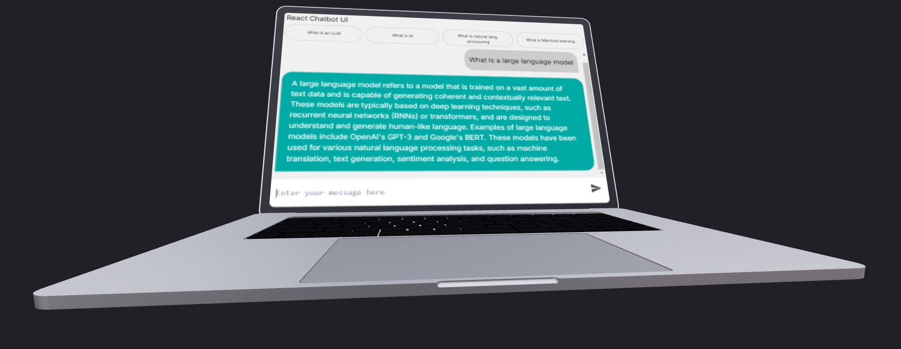

# 3DSubjectChatbot

## Overview
The Subject Chatbot helps the student to ask some basic questions about the given subject(I have considered AI and ML books for traning it).

## How to run it
The project consists of both frontend react and backend flask components. Below, you'll find explanations of the working of each folder, along with the commands to run the Python (backend) and React (frontend) applications.

#### run frontend react app
``` 
npm install
npm run build
npm start 
```

#### run backend flask
```
pip install -r requirements.txt
python app.py
```
Note: Before executing the above commands, be sure you are in the respective folder.

### Frontend
- The `frontend` folder contains the user interface components of the chatbot which is created using react and react-three/fiber

#### Features
- It contains an input field where user can enter the question and the chatbot returns the answer.
- it also contains 4 buttons as conversation starters

### Backend
- The `backend` folder contains the flask server which takes the user questions and sends the answers to the React UI.
#### Features
The backend is designed using Flask.
- We take the input from the user and use langchain library and we get the answer from the pre-trained openAI network and then send back the answer to the user.
- Currently, we trained the model using only two books data b4 and b5 which are inside the backend folder.

### Deployed working prototype
- The working prototype can be checked in the following url
``` 
https://3-d-subject-chatbot.vercel.app/
```

### Note: These are the features yet to be added
- 1. Need to serve different sessions for different users
- 2. Reset functionality for the existing user and erase the conversation to start a new convo.
- 3. Deploy in a much faster hosting
- 4. Traing the model with more data. Currently its trained on only 2 books.
